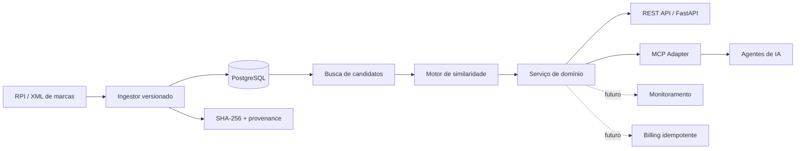

# INPI MCP — Inteligência de Marcas para Agentes de IA


> Plataforma experimental de inteligência de propriedade industrial com interface MCP para pesquisa, comparação e consulta de marcas brasileiras.

**Projeto independente, não oficial e sem vínculo institucional com o Instituto Nacional da Propriedade Industrial (INPI).**

O **INPI MCP** é um MVP técnico que transforma publicações estruturadas de marcas em uma camada consultável por APIs e agentes de IA. O projeto combina ingestão versionada, PostgreSQL, busca de candidatos, cálculo explicável de similaridade e uma interface baseada no **Model Context Protocol (MCP)**.

O objetivo não é substituir análise jurídica nem afirmar disponibilidade de registro. O sistema produz **evidência computacional rastreável** para apoiar pesquisa e monitoramento.

## Estado atual

**Portfolio Release v1 — DEV**

| Capacidade | Estado |
|---|---|
| API FastAPI | Implementada |
| PostgreSQL | Implementado |
| Ingestão XML com SHA-256 | Implementada |
| Idempotência de eventos | Implementada |
| Busca de marcas | Implementada |
| Similaridade lexical/fonética | Implementada |
| Explicabilidade do score | Implementada |
| Servidor MCP | Implementado |
| Runtime MCP | Validado em DEV em 03/10/2026 |
| Testes automatizados | 5 testes aprovados na validação de 03/10/2026 |
| CI para GitHub Actions | Preparada localmente; ainda não executada no GitHub |
| Ingestão da RPI real completa | **Ainda não declarada como concluída nesta release** |
| Monitoramento contínuo | Planejado |
| Billing / créditos | Planejado |
| Multi-tenant | Planejado |

Consulte [docs/validation.md](docs/validation.md) para os limites das evidências atuais.

## Por que este projeto existe

Pesquisar marcas de forma útil para software exige mais do que executar uma busca textual. É necessário preservar a origem da informação, normalizar sinais, reconstruir eventos publicados, controlar duplicidade e separar claramente **similaridade computacional** de **conclusão jurídica**.

Este projeto foi desenhado com esses princípios:

- fonte oficial como origem dos dados;
- ingestão determinística e versionada;
- preservação de SHA-256 da fonte;
- eventos idempotentes;
- separação entre domínio e protocolo MCP;
- scores explicáveis e versionados;
- nenhuma promessa de aprovação pelo INPI;
- arquitetura preparada para monitoramento e auditoria.

## Arquitetura



Detalhes: [docs/architecture.md](docs/architecture.md).

## MCP disponível

O servidor MCP atual expõe três ferramentas:

- `search_trademark` — pesquisa marcas por nome e classes de Nice;
- `compare_trademark` — compara dois sinais e retorna decomposição do score;
- `get_trademark` — consulta um processo conhecido na base.

A lógica de negócio não fica dentro do servidor MCP. O MCP funciona como **adaptador do domínio**, reduzindo acoplamento entre agentes e implementação interna.

Veja contratos e exemplos em [docs/mcp-tools.md](docs/mcp-tools.md).

## Similaridade explicável

O motor atual combina proximidade lexical, proximidade fonética, estrutura de tokens e afinidade por classe de Nice. Cada resultado inclui a versão do motor e fatores que contribuíram para o score.

```json
{
  "overall": 0.92,
  "lexical": 0.95,
  "phonetic": 0.94,
  "token_structure": 0.93,
  "semantic": 0.0,
  "market_affinity": 1.0,
  "engine_version": "sim-v0.1.0",
  "reasons": [
    "alta proximidade gráfica/lexical",
    "alta proximidade fonética computacional",
    "mesma classe Nice informada"
  ]
}
```

O campo `semantic` permanece em `0.0` nesta versão; embeddings e calibração avançada pertencem ao roadmap.

## Stack

- Python 3.13 no container de DEV;
- compatibilidade declarada: Python 3.11+;
- FastAPI;
- SQLAlchemy;
- PostgreSQL 16;
- psycopg;
- RapidFuzz;
- Unidecode;
- Pydantic;
- MCP Python SDK;
- Docker / Docker Compose;
- Pytest.

## Executando a API

```bash
docker compose up --build
```

Health check:

```text
GET http://localhost:8000/health
```

Resposta esperada:

```json
{"status":"ok","version":"0.1.0"}
```

### Pesquisa REST

```text
POST /v1/trademarks/search
```

```json
{
  "query": "GENTILL MOB",
  "nice_classes": [39],
  "include_similar": true,
  "limit": 20
}
```

### Comparação REST

```text
POST /v1/trademarks/compare
```

```json
{
  "left": {"name": "GENTILL MOB", "nice_classes": [39]},
  "right": {"name": "GENTIL MOB", "nice_classes": [39]}
}
```

## Executando o MCP localmente

```bash
pip install -e ".[mcp,test]"
python -m app.mcp_server
```

Um exemplo de configuração de host está em [examples/mcp-host-config.example.json](examples/mcp-host-config.example.json).

## Testes

```bash
pytest -q
```

A suíte atual cobre health e pesquisa via API, ingestão XML, idempotência, normalização e similaridade.

O workflow em `.github/workflows/ci.yml` foi preparado para executar testes e smoke de importação do MCP em Python 3.11 e 3.13 quando o projeto for publicado no GitHub.

## Estrutura principal

```text
app/
tests/
fixtures/
db/
docs/
examples/
.github/workflows/
Dockerfile
docker-compose.yml
pyproject.toml
```

O diretório interno `vault/`, fontes brutas, evidências locais e artefatos operacionais permanecem fora da publicação por padrão.

## O que está implementado e o que não está

Esta versão deve ser lida como **MVP técnico auditável**, não como SaaS pronto para produção.

Ainda faltam ingestão e reconciliação de uma fonte real completa comprovada, calibração com dataset representativo, autenticação, multi-tenant, rate limiting, monitoramento recorrente, notificações, billing idempotente, observabilidade de produção e hardening de segurança/LGPD.

O endpoint administrativo de ingestão é uma facilidade de **DEV** e não deve ser exposto publicamente no estado atual.

## Segurança e publicação

Antes de qualquer publicação real:

1. revisar [docs/public-readiness.md](docs/public-readiness.md);
2. confirmar o conjunto exato de arquivos a adicionar ao Git;
3. não versionar `.env`, `raw/`, `.gentill/`, logs ou evidências locais;
4. manter o endpoint administrativo restrito a DEV;
5. executar a CI remota antes de considerar a release pública validada.

Consulte também [SECURITY.md](SECURITY.md).

## Licença

Esta preparação **não transforma o projeto em open source**. O código permanece com direitos reservados para fins de portfólio e avaliação, conforme [LICENSE](LICENSE). Uma licença permissiva poderá ser escolhida posteriormente mediante decisão explícita do autor.

## Decisões de engenharia

1. MCP é adaptador, não camada de negócio.
2. RPI/XML é tratada como fluxo de eventos, não como garantia de estado consolidado completo.
3. Fontes brutas devem manter hash e versão do parser.
4. Similaridade é índice computacional, não parecer jurídico.
5. Reprocessamentos devem ser determinísticos e idempotentes.

Detalhes em [docs/architecture.md](docs/architecture.md).

## Aviso

Este software é experimental e possui finalidade técnica e informativa. Resultados de similaridade não constituem parecer jurídico, decisão do INPI ou garantia de registrabilidade de marca.
