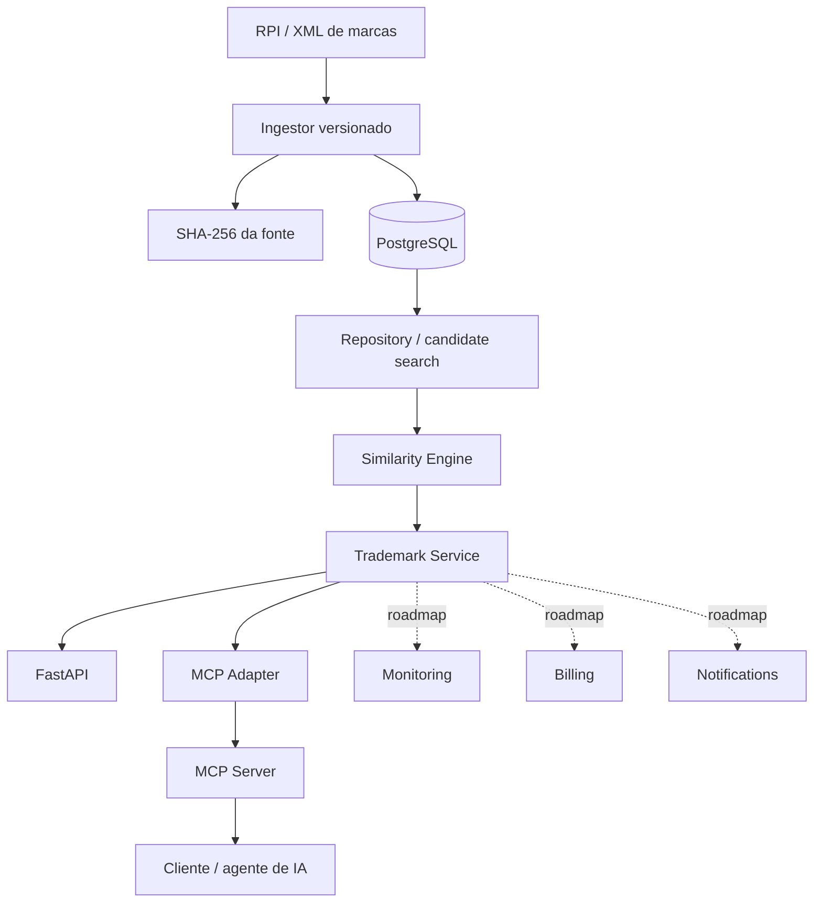

# Arquitetura do INPI MCP

## Objetivo

Separar ingestão, persistência, busca, similaridade, domínio e protocolos externos para que o MCP não concentre regras de negócio.

## Visão atual



## Fluxo de ingestão

```text
arquivo XML
  -> SHA-256 da fonte
  -> parser versionado
  -> processo de marca
  -> classes de Nice
  -> eventos publicados
  -> hash estável do payload
  -> constraint de idempotência
```

O parser atual usa `xml.etree.ElementTree.iterparse`, evitando carregar todo o XML em memória de uma única vez.

## Persistência

As entidades principais são:

- `TrademarkProcess`;
- `TrademarkNiceClass`;
- `TrademarkEvent`.

Eventos possuem RPI, data, código e nome do despacho, protocolo, `raw_payload_hash`, `parser_version` e timestamp de ingestão.

A constraint de eventos impede a duplicação da mesma publicação quando o arquivo é reprocessado.

## Busca e ranking

O repository recupera candidatos da base. O serviço de domínio aplica o motor de similaridade e retorna resultados ordenados com explicação.

A arquitetura permite substituir ou expandir o mecanismo de candidatos sem alterar o contrato MCP.

## Motor de similaridade

Versão atual: `sim-v0.1.0`.

| Componente | Implementação atual |
|---|---|
| Lexical | RapidFuzz |
| Fonético | normalização fonética pt-BR do projeto |
| Estrutura de tokens | token-set similarity |
| Semântico | reservado; score atual 0 |
| Afinidade de mercado | classes de Nice informadas |

O score é explicitamente computacional. O projeto não converte esse valor em probabilidade de deferimento ou conclusão jurídica.

## Boundary MCP

```text
MCP Server
    -> MCP Adapter
        -> Trademark Service
            -> Repository / Similarity
```

Essa separação mantém o protocolo substituível e permite que REST API e MCP usem a mesma lógica de domínio.

## Componentes planejados

Ainda não fazem parte da implementação atual:

- autenticação e autorização;
- multi-tenant;
- monitoramento recorrente;
- scheduler de ingestão;
- alertas;
- billing idempotente;
- embeddings / busca semântica;
- observabilidade de produção.

Esses elementos aparecem no roadmap, mas não devem ser apresentados como capacidades concluídas.
